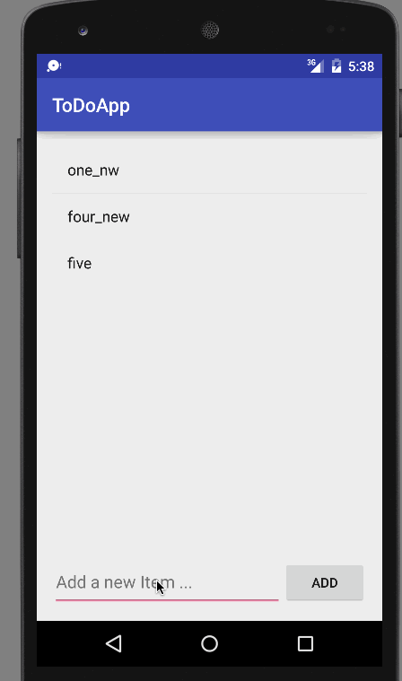

# Simple ToDo App

This is an Android demo application for adding New ToDo items, Deleting them and Editing them. This is build as part of prework for [Codepath Android prework] (http://courses.codepath.com/snippets/intro_to_android/prework.md)

Time spent: 3 hours spent in total

Completed user stories:

 * [x] Required: Add and Delete Todo Items 
 * [x] Required: Edit Todo Item 
 * [ ] Optional: WIP... 
 
Notes:
Intent : was the key ! 

Walkthrough of all user stories:

GIF created with [LiceCap](http://www.cockos.com/licecap/).

